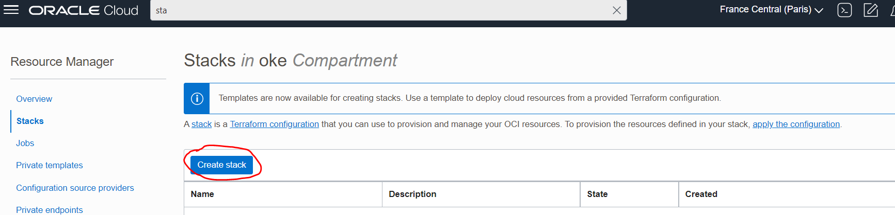

# oke-networking
To create a Stack through OCI Resource Manager, create a zip with all the files in this folder, then click
on "Create stack":

Create a zip compressed folder with the following files and folders:

* oke-vcn
* data.tf
* main.tf
* outputs.tf
* provider.tf
* stack.auto.tfvars
* variables.tf

Then, upload it as the stack configuration and click on "Next":

In the "configure variables" section, all the variables should be already prepopulated:

* **compartment_ocid**: defaults to the compartment ocid of the stack, specify another compartment ocid if you want the VCN and OKE cluster to be created in another compartment.
* **oke_cluster_name**: name of the oke cluster to create.
* **oke_vcn_name**: name of the vcn for the oke cluster to create.
* **region**: region where to create resources.
* **tenancy_ocid**: tenancy where to create resources.

As a last step, review the stack and create it. Once created, run a Plan job to see the resources that will be created, and then an "Apply" job to create all of them.

**NOTE**: The Apply job can take up to 10 minutes.

The resources that will be created by the stack are:

* 1 VCN with all security list configured.
* 1 OKE cluster without node pools.